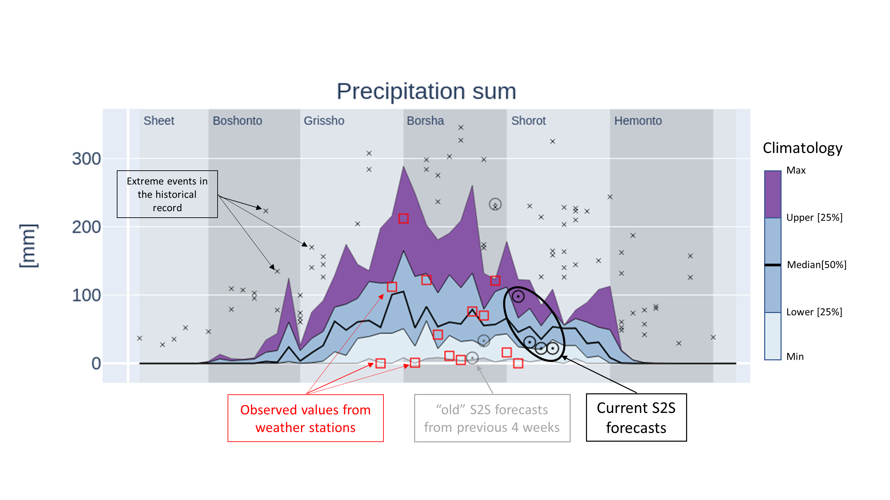

Introduction
============

This document provides charts for interpreting the current S2S forecast for Bangladesh
at the district level relative to the climatology of each district. The term "S2S"
is an acronym for "subseasonal to seasonal" which indicates that this forecast is
different from traditional forecasts which are either short-term forecasts or seasonal forecasts.
The short term forecasts provide daily values of important weather variables up to 10 days
ahead. Seasonal forecasts provide monthly estimates of average temperature and rainfall sums up
till 6 months ahead. Instead, S2S forecasts are placed in between and provide weekly values
of average maximum and minimum temperature as well as rainfall sums up till 4 weeks ahead.

The unique ability of S2S forecasts is to extend the short term forecast in order to provide an
outlook on the expected weather patterns that farmers can use to plan their activities and raise
preparedness for certain events.

.. _explanation:

Explanation of the charts
-------------------------

This ReadTheDocs page provides the S2S forecast for each division and district in Bangladesh. For each district
three charts are generated:

1. *Precipitation*: this shows the weekly precipitation sum.
2. *Mean maximum temperature*: this shows the weekly mean maximum temperature.
3. *Mean minimum temperature*: this shows the weekly mean minimum temperature.

An example is provided below.

The X-axis shows the week number which ranges from 1 (first week of January) to 53 (last week of December).
The X-axis grid is not displayed because the grid lines are usually plotted every five or ten weeks which
is not informative. Instead, the six seasons of Bangladesh are plotted in the background in grey colors
with the name of the seasons on the top of chart. The Y-axis shows the range and units of the variable of interest,
either precipitation in mm or temperature in degrees Celsius.

Each plot has several elements that must be understood in order to properly interpret the figure.
First of all, on the background the climatology is presented as a set of lines with colors filled
in between. The climatology is based on records of
the historical observed weather and it represents the variability in weather that has been observed
in the past. The thick line in the centre
of the chart represents the median value. The lines above and below the median represent 
the 25th and 75th percentiles. The areas from P25 to the median and from the
median to P75 have the same color and represent 50% of the data points in the climatology.
The lower and upper lines represent the estimated minimum and maximum of the distributions and
the areas in between are filled with different colours to indicate that values in
this range are more extreme. Outside of the minimum/maximum values, there can still be outliers
that represent extreme cases, these are plotted individually and are marked with an "x" marker.
This mainly occurs with precipitation data due to the erratic nature of precipitation.

The second element is the current S2S forecasts (details are given under :ref:`Forecast metadata`)
which is represented as four black circles on top of the climatology.
By comparing the current forecast against the climatology it
is immediately clear how that forecast relates to the climatology: is the forecast value average, extremely
high or low. Moreover, the interpretation can be made for the coming four weeks as well. When looking
at the HTML figures, hovering the mouse point above a circle of the S2S forecast will pop up a label
with additional information.

The third element is the observed values which are plotted as red squares. These values represent the temperature
and precipitation that were recorded by a weather station inside or near the district. These values can
be used to support the analysis in order to understand how the cropping season is progressing. When hovering
the mouse pointer above a red square a label will appear with additional information (only for HTML figures).

Finally, the last element is the set of previous S2S forecasts that were issued along the season. The plot shows the S2S
forecasts for the last 4 weeks as grey circles. The grey circles can be compared with the red squares
(the observed weather) to assess if the previous S2S forecasts were accurate. Take into account however,
that there may be a difference between the forecasted location (the centre of the District) and the location
of the weather station.

By default, the figures are provided as Scaleable Vector Graphics (SVG) which are compact, 
fast, scale well within a web browser and do not require an internet connection.

Alternatively, each figure is available as an an interactive HTML element that you can open
with the link provide above each figure (hold the CTRL key for opening in a new window).
HTML figures can be zoomed and rescaled in order to optimize the axis ranges, you can zoom
into certain parts of the chart and there are hover labels available (move your mouse pointer over
the circles) which give more information over the S2S forecast values.
Moreover, HTML figures can be exported to other data formats. Displaying HTML figures is relatively
slow therefore they are not used by default.

Background and financing
------------------------
Jointly prepared by Bangladesh Meteorological Department (BMD), Bangladesh Department of Agricultural Extension
(DAE), Weather Impact-Netherlands, Wageningen Environmental Research and Digital Innovation for Impact (Dii-Dhaka)
under BWCSRP (Component-C), supported by the World Bank.

Contact info
------------

For questions contact dr. Allard de Wit (allard.dewit@wur.nl), Wageningen Environmental Research.
