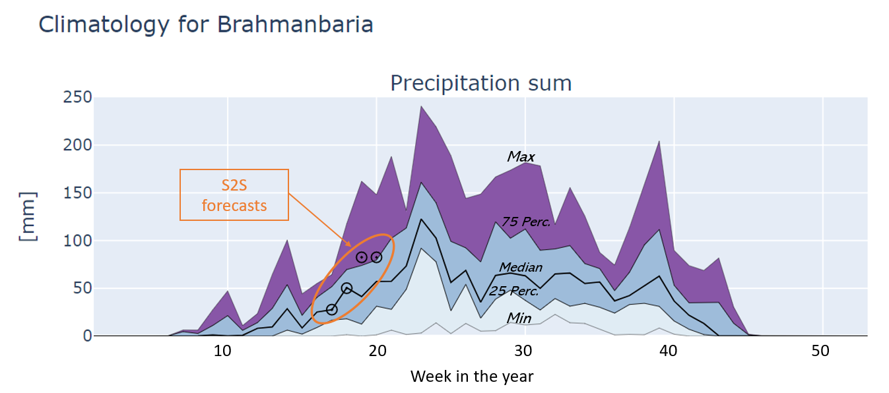

Introduction
============

This document provides charts for interpreting the current S2S forecast for Bangladesh
at the district level relative to the climatology of each district. For each district
three charts are generated:

- *Precipitation*: this shows the climatology of the weekly precipitation sum plus the
  current S2S forecast for precipitation plotted as circles. 
- *Mean maximum temperature*: this shows the climatology of the weekly mean maximum 
  temperature plus the current S2S forecast for maximum temperature plotted as circles.
- *Mean minimum temperature*: this shows the climatology of the weekly mean minimum 
  temperature plus the current S2S forecast for minimum temperature plotted as circles.

The interpretation of the climatology is as follows: The thick line in the centre 
of the chart represents the median value. The lines above and below the median represent 
the first (Q1) and third (Q3) quartiles. The areas from Q1 to the median and from the 
median to Q3 have the same color and represent 50% of the data points in the climatology.
The lower and upper lines represent the minimum and maximum of the distributions and
the areas in between are filled with different colours to indicate that values in
this range are more extreme. 

The current S2S forecast (details are given under "Forecast metadata") are added to the 
climatology as circles. By comparing the current forecast against the climatology it
is immediately clear how that forecast relates to the climatology: is the average, extremely
high or low. Moreover, the interpretation can be made for the coming four weeks as well. 

See also the example below.

By default, the figures are provided as Scaleable Vector Graphics (SVG) which are compact, 
fast, scale well within a web browser and do not require an internet connection. 
Alternatively, each figure is available as an an interactive HTML element that
can be zoomed and exported to other data formats. However, this requires an internet connection
and is relatively slow. Therefore by default the SVG figures are used.

Background and financing
------------------------
Jointly prepared by Bangladesh Meteorological Department (BMD), Bangladesh Department of Agricultural Extension
(DAE), Weather Impact-Netherlands, Wageningen Environmental Research and Digital Innovation for Impact (Dii-Dhaka)
under BWCSRP (Component-C), supported by the World Bank.
